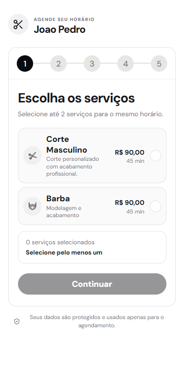
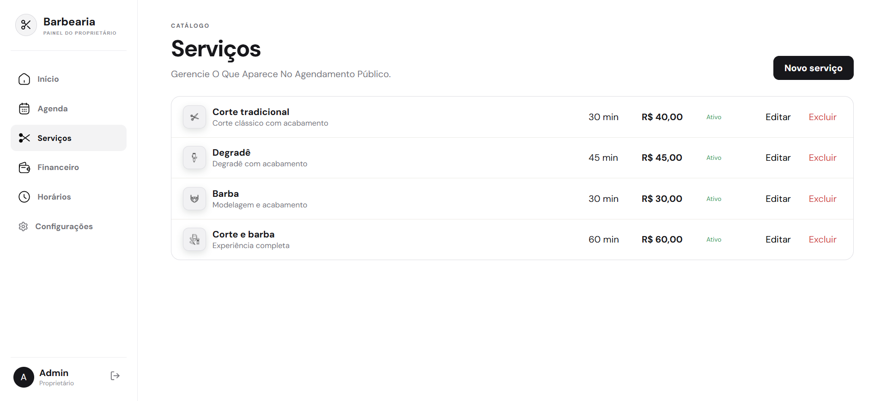
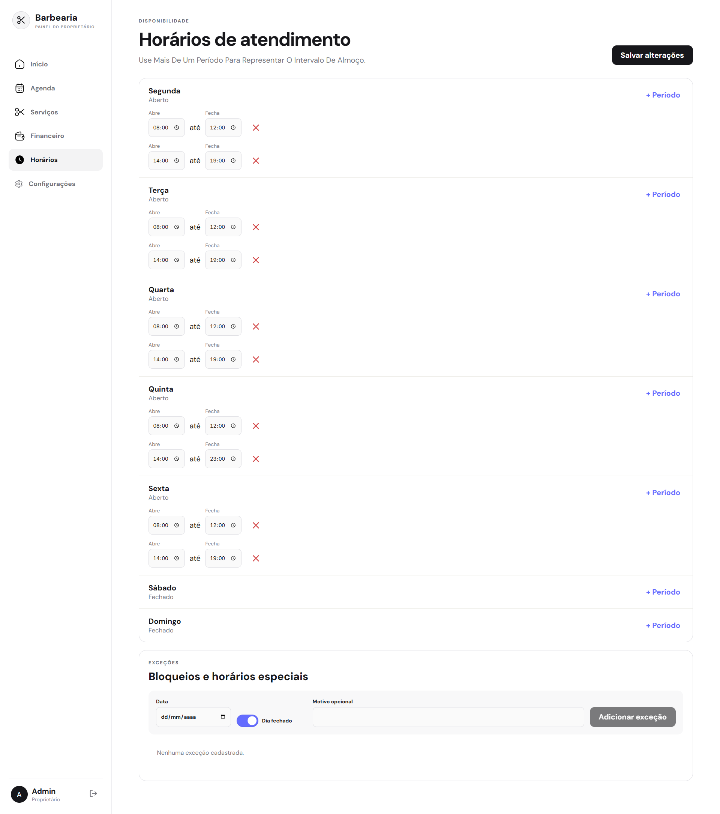
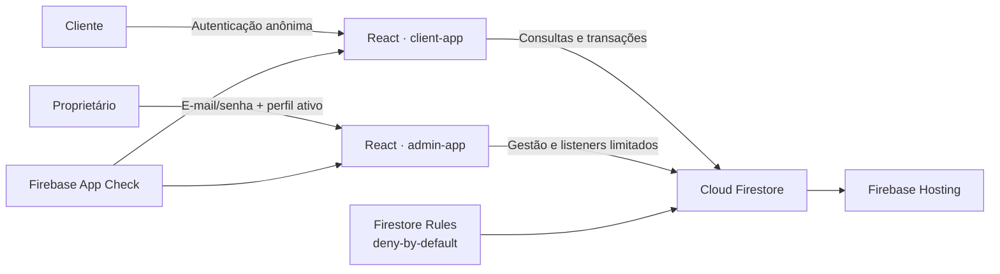

<div align="center">

# Sistema de agendamento para barbearia

Uma plataforma serverless para organizar a jornada completa de uma barbearia:<br>
agendamento online para clientes, operação diária para o proprietário e proteção de dados no Firebase.


</div>

## Sobre o projeto

O sistema foi construído para eliminar conflitos de horário e centralizar a rotina de uma barbearia sem depender de um servidor tradicional. Dois aplicativos React independentes compartilham a mesma camada de autenticação e dados:

- o **site do cliente**, mobile-first, permite escolher até dois serviços, consultar a disponibilidade real, reservar, reagendar e cancelar;
- o **painel do proprietário** concentra agenda, serviços, horários, exceções e indicadores financeiros;
- a camada **Firebase** aplica autorização, validação e consistência por meio de regras deny-by-default e transações atômicas.

> [!IMPORTANT]
> O painel administrativo não possui link, usuário ou senha públicos neste repositório. Sua interface é apresentada somente nas capturas abaixo, em modo claro e sem registros identificáveis de clientes.

## Experiência do cliente

As imagens abaixo foram produzidas em ambiente local com informações fictícias.

<table>
  <tr>
    <td align="center"><strong>Escolha de serviços</strong></td>
    <td align="center"><strong>Revisão do agendamento</strong></td>
  </tr>
  <tr>
    <td></td>
    <td></td>
  </tr>
</table>

O fluxo conduz o cliente por cinco etapas claras: serviço, dia, horário, contato e confirmação. Preço e duração são recalculados automaticamente sempre que a seleção muda.

## Painel do proprietário

As capturas administrativas selecionadas não contêm agenda, nome, telefone ou observação de clientes.

### Catálogo de serviços



### Disponibilidade e exceções

<details>
  <summary><strong>Ver tela completa de horários em modo claro</strong></summary>
  <br>
  
</details>

## Principais recursos

| Área | Recursos |
|---|---|
| Agendamento público | Até dois serviços por reserva, calendário de disponibilidade, horários em tempo real, confirmação e resumo |
| Autonomia do cliente | Consulta do próprio agendamento, troca de serviços, reagendamento e cancelamento |
| Operação diária | Visão do dia, agenda semanal, detalhes do atendimento, confirmação, conclusão e cancelamento |
| Catálogo | Cadastro, edição, ordenação, ativação e exclusão de serviços |
| Disponibilidade | Grade semanal, múltiplos períodos por dia, bloqueios e horários especiais |
| Financeiro | Receita concluída, ticket médio, cancelamentos e distribuição por forma de pagamento |
| Responsividade | Experiência mobile-first para clientes e painel adaptado para diferentes telas |

## Arquitetura



O projeto não depende de Cloud Functions, Cloud Run ou um backend próprio. Criação, cancelamento e reagendamento utilizam transações do SDK Web combinadas com regras do Firestore que validam o estado final da operação.

## Decisões de engenharia

- **Reserva e disponibilidade são uma única operação:** o agendamento e os intervalos ocupados são gravados juntos. Em uma disputa pelo mesmo horário, apenas uma transação é concluída.
- **O navegador não define preço nem duração:** as regras conferem os serviços ativos e seus valores antes de aceitar a reserva.
- **Autorização por identidade e papel:** clientes anônimos acessam somente os próprios documentos; o painel exige autenticação e perfil `owner` ativo.
- **Financeiro derivado dos atendimentos:** os resumos podem ser reconstruídos a partir dos registros concluídos, reduzindo o risco de divergências após cancelamentos ou reagendamentos.
- **Custo operacional reduzido:** a arquitetura foi pensada para funcionar no plano Spark, com consultas limitadas, cache de dados públicos e ausência de documentos para horários vazios.
- **Aplicações separadas:** cliente e painel possuem builds e configurações independentes, diminuindo o acoplamento e permitindo deploys isolados.

## Stack

- **Frontend:** React 19, TypeScript, Vite e React Router;
- **Interface:** CSS responsivo, Lucide React e React Icons;
- **Plataforma:** Firebase Authentication, Cloud Firestore, App Check e Hosting;
- **Qualidade:** TypeScript estrito, Node Test Runner, Firebase Emulator Suite e Rules Unit Testing;
- **Segurança HTTP:** CSP, HSTS, `nosniff`, Referrer Policy, bloqueio de enquadramento e Permissions Policy.

## Estrutura do repositório

```text
.
├── client-app/             # Jornada pública de agendamento
├── admin-app/              # Operação privada da barbearia
├── firebase/
│   ├── firestore.rules     # Autorização e validação dos dados
│   ├── firestore.indexes.json
│   ├── seed.mjs            # Dados iniciais para desenvolvimento
│   └── tests/              # Testes das regras no Emulator
├── docs/images/            # Capturas públicas e sanitizadas
├── firebase.json
└── package.json            # Workspaces e comandos do monorepo
```

## Como executar localmente

### Pré-requisitos

- Node.js 20 ou superior;
- Java 21 ou superior para o Firebase Emulator Suite;
- Firebase CLI, instalada pelas dependências do projeto.

### Instalação

```powershell
npm install
Copy-Item client-app/.env.example client-app/.env.local
Copy-Item admin-app/.env.example admin-app/.env.local
Copy-Item .firebaserc.example .firebaserc
```

Preencha os arquivos `.env.local` com a configuração de um projeto Firebase próprio. Os arquivos locais, tokens de debug e o `.firebaserc` real são ignorados pelo Git.

### Desenvolvimento

```powershell
# Cliente público com Auth e Firestore locais
npm run dev:client:local

# Aplicativos individualmente
npm run dev --prefix client-app
npm run dev --prefix admin-app
```

O painel não oferece cadastro público. Para testes locais, crie sua própria conta no Auth Emulator e um perfil administrativo compatível com as regras; nenhuma credencial é fornecida ou versionada.

## Segurança e privacidade

As regras do Firestore:

- vinculam cada reserva pública ao UID anônimo que a criou;
- impedem leitura ou alteração de reservas de outros clientes;
- validam serviço, preço, duração, grade semanal, exceções, antecedência e janela máxima;
- exigem intervalos sequenciais e evitam dupla ocupação;
- protegem dados de contato, pagamento e financeiro contra alterações não autorizadas;
- bloqueiam mudanças depois do início, conclusão ou cancelamento do atendimento;
- exigem `role == "owner"` e `active == true` para operações administrativas;
- negam por padrão qualquer caminho não declarado.

O `localStorage` guarda somente o identificador opaco do último agendamento. As credenciais de autenticação são mantidas pelo SDK do Firebase.

## Testes e validação

```powershell
# Testes das regras no Firestore Emulator
npm run test:rules

# TypeScript estrito + builds de produção
npm run build

# Suíte completa
npm test
```

A suíte cobre isolamento entre usuários, criação com um ou dois serviços, concorrência por horário, adulteração de preço, intervalos inválidos, dias fechados, exceções, cancelamento, troca de serviços, reagendamento no mesmo dia e entre dias, além dos papéis administrativos.

## Limitações conhecidas

- se o armazenamento do navegador for apagado, o UID anônimo pode ser perdido e a reserva deixa de ser recuperável publicamente naquele dispositivo;
- não existe busca pública por telefone ou por um ID informado manualmente;
- no plano Spark, o serviço pode ficar temporariamente indisponível caso a franquia gratuita seja excedida.

## Autor

Desenvolvido por [Emanuel Candido](https://github.com/EmanuelCandido).
