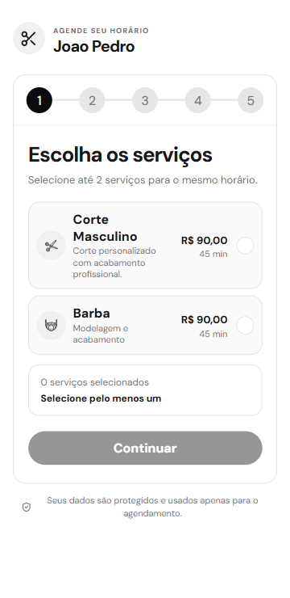
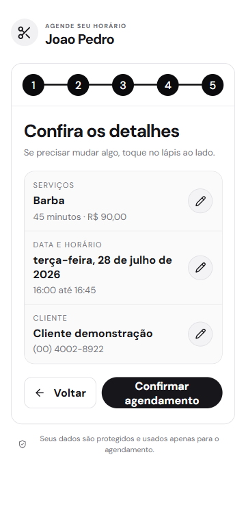
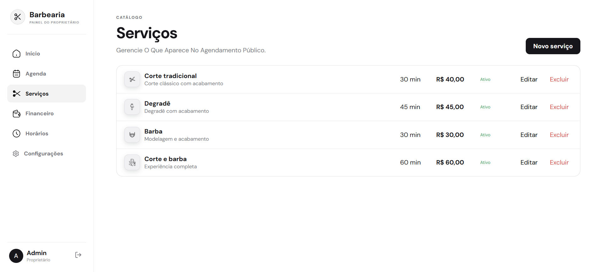
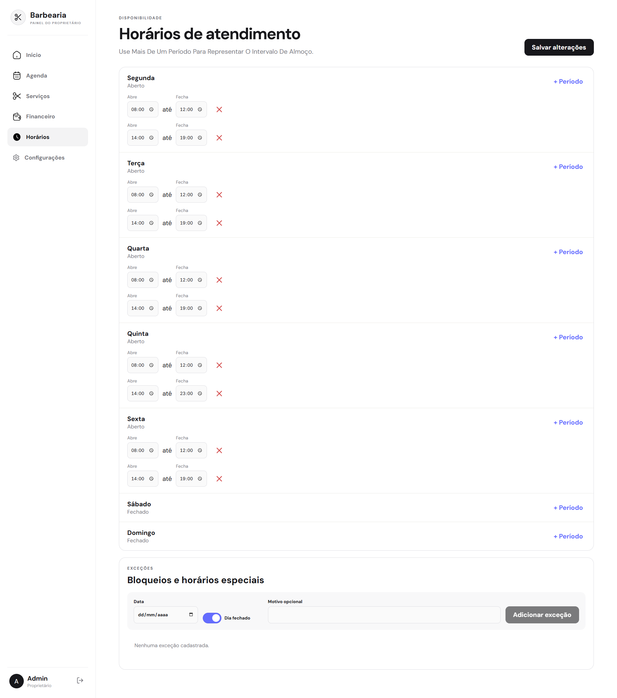
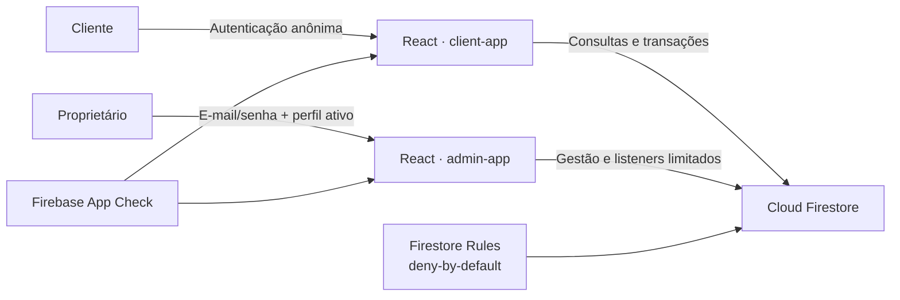

<div align="center">

# Agendamento Online para Barbearia

**Menos mensagens no WhatsApp. Mais cadeiras ocupadas.**<br>
Um site de agendamento para os seus clientes e um painel de gestão para você, tudo em um só sistema.


</div>

## O problema que resolvemos

Agendar por mensagem toma tempo, gera conflitos de horário e faz o barbeiro parar o corte para responder. Clientes desistem quando demoram a receber resposta, e o controle financeiro acaba espalhado em cadernos e conversas.

## A solução

Um sistema completo, pronto para usar, com duas partes que trabalham juntas:

| | Para quem | O que entrega |
|---|---|---|
| **Site de agendamento** | Seus clientes | Reservam sozinhos, a qualquer hora, direto pelo celular, sem baixar aplicativo e sem criar conta |
| **Painel de gestão** | Você, proprietário | Agenda do dia, serviços, horários de atendimento e resultados financeiros em um só lugar |

## Experiência do cliente

O agendamento leva poucos toques, em cinco passos: **serviço → dia → horário → contato → confirmação**. O preço e a duração são calculados automaticamente conforme a escolha.

<table>
  <tr>
    <td align="center"><strong>Escolha de serviços</strong></td>
    <td align="center"><strong>Revisão do agendamento</strong></td>
  </tr>
  <tr>
    <td></td>
    <td></td>
  </tr>
</table>

- Combina até **dois serviços** na mesma visita (ex.: cabelo + barba);
- Mostra **somente horários realmente livres**, atualizados em tempo real;
- Exibe **local e detalhes** do atendimento na confirmação;
- Permite **consultar, trocar serviços, reagendar ou cancelar** sem precisar ligar;
- Funciona bem em qualquer celular, com visual limpo e rápido.

> As imagens usam dados fictícios.

## Painel do proprietário

Acesso exclusivo e protegido por login. Nada de agenda ou dados de clientes é exposto publicamente.

### Catálogo de serviços



### Horários de atendimento e exceções

<details>
  <summary><strong>Ver tela de horários</strong></summary>
  <br>
  
</details>

## Funcionalidades

| Área | O que você ganha |
|---|---|
| **Agenda** | Visão do dia e da semana, detalhes de cada atendimento, confirmar, concluir, reagendar e cancelar |
| **Serviços** | Cadastre, edite, reordene, ative/desative e remova serviços com preço e duração |
| **Horários** | Grade semanal com vários períodos por dia (ex.: manhã e tarde), folgas, feriados e horários especiais |
| **Financeiro** | Receita, ticket médio, cancelamentos e divisão por forma de pagamento |
| **Cliente** | Agendamento 24h, sem conflitos, com reagendamento e cancelamento por conta própria |
| **Modo claro e escuro** | Interface confortável em qualquer ambiente |

## Benefícios para o negócio

- **Mais tempo no atendimento:** o sistema responde por você, a qualquer hora.
- **Fim da dupla marcação:** dois clientes nunca conseguem reservar o mesmo horário.
- **Menos faltas e improvisos:** o cliente remarca ou cancela com antecedência, liberando a vaga.
- **Controle financeiro automático:** os números saem direto dos atendimentos concluídos.
- **Imagem profissional:** seus clientes agendam em um site próprio, moderno e rápido.
- **Custo de operação mínimo:** a infraestrutura em nuvem foi pensada para caber na camada gratuita do Firebase em barbearias de pequeno e médio porte.

## Segurança e privacidade

- Cada cliente enxerga **apenas o próprio agendamento**;
- O painel exige login de proprietário com perfil ativo e política de senha forte;
- **Preços e durações são validados no servidor**: ninguém consegue alterar valores pelo navegador;
- Proteção contra uso indevido com Firebase App Check;
- Cabeçalhos de segurança no site (CSP, HSTS, bloqueio de enquadramento, entre outros);
- Dados de contato e financeiros protegidos contra alteração não autorizada.

## O que está incluído na entrega

- Site de agendamento do cliente, publicado e funcionando;
- Painel administrativo com acesso do proprietário;
- Configuração de serviços, preços, horários e local da barbearia;
- Regras de segurança testadas automaticamente;
- Documentação para operação e manutenção.

## Limitações conhecidas

- Se o cliente limpar os dados do navegador, não consegue mais consultar a reserva naquele aparelho (a barbearia continua vendo o agendamento no painel);
- Não há busca pública de reservas por telefone;
- Na camada gratuita do Firebase, o serviço pode ficar indisponível caso a franquia diária seja excedida. É possível migrar para o plano pago sem alterar o sistema.

---

## Documentação técnica

<details>
<summary><strong>Arquitetura, stack e execução local</strong></summary>

### Arquitetura


```mermaid
flowchart LR
    C["Cliente"] -->|"Autenticação anônima"| CLIENT["React · client-app"]
    O["Proprietário"] -->|"E-mail/senha + perfil ativo"| ADMIN["React · admin-app"]
    CLIENT -->|"Consultas e transações"| FS["Cloud Firestore"]
    ADMIN -->|"Gestão e listeners limitados"| FS
    RULES["Firestore Rules<br>deny-by-default"] --> FS
    CHECK["Firebase App Check"] --> CLIENT
    CHECK --> ADMIN
```

Sem backend próprio: criação, cancelamento e reagendamento usam transações do SDK Web, e as regras do Firestore validam o estado final. Reserva e intervalos ocupados são gravados atomicamente; em disputa pelo mesmo horário, só uma transação é concluída. Os resumos financeiros são derivados dos atendimentos concluídos.

### Stack

- **Frontend:** React 19, TypeScript, Vite e React Router (wouter);
- **Interface:** CSS responsivo, Lucide React e React Icons;
- **Plataforma:** Firebase Authentication, Cloud Firestore, App Check e Hosting;
- **Qualidade:** TypeScript estrito, Node Test Runner, Firebase Emulator Suite e Rules Unit Testing.

### Estrutura

```text
.
├── client-app/             # Site público de agendamento
├── admin-app/              # Painel privado da barbearia
├── firebase/
│   ├── firestore.rules     # Autorização e validação dos dados
│   ├── firestore.indexes.json
│   ├── seed.mjs            # Dados iniciais para desenvolvimento
│   └── tests/              # Testes das regras no Emulator
├── docs/images/            # Capturas públicas e sanitizadas
├── firebase.json
└── package.json            # Workspaces e comandos do monorepo
```

### Executar localmente

Requisitos: Node.js 20+, Java 21+ (Firebase Emulator Suite).

```powershell
npm install
Copy-Item client-app/.env.example client-app/.env.local
Copy-Item admin-app/.env.example admin-app/.env.local
Copy-Item .firebaserc.example .firebaserc
```

Preencha os `.env.local` com a configuração de um projeto Firebase próprio. Depois:

```powershell
# Cliente com Auth e Firestore locais
npm run dev:client:local

# Aplicativos individualmente
npm run dev --prefix client-app
npm run dev --prefix admin-app
```

O painel não possui cadastro público; para testes locais, crie uma conta no Auth Emulator com perfil `owner` ativo.

### Testes

```powershell
npm run test:rules   # regras no Firestore Emulator
npm run build        # TypeScript estrito + builds de produção
npm test             # suíte completa
```

A suíte cobre isolamento entre usuários, concorrência por horário, adulteração de preço, intervalos inválidos, dias fechados, exceções, cancelamento, troca de serviços, reagendamento e papéis administrativos.

### Publicação

> [!IMPORTANT]
> O site do cliente em produção é [agendamento-josenilson.netlify.app](https://agendamento-josenilson.netlify.app). Alterações em `client-app` devem ser compiladas (`npm run build --prefix client-app`) e publicadas com o deploy de `client-app/dist` diretamente no site `agendamento-josenilson` do Netlify. Publicar só no Firebase Hosting ou enviar ao GitHub não atualiza a produção.

</details>

## Contato

Desenvolvido por [Emanuel Candido](https://github.com/EmanuelCandido).
